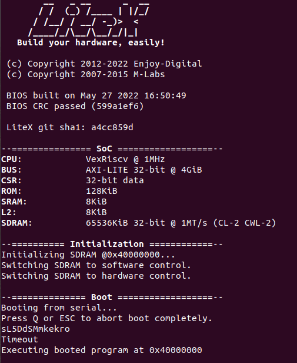
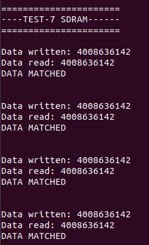
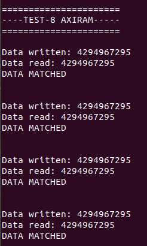
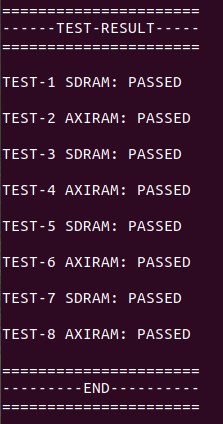

# Vexriscv SoC with UART & SDRAM + AXI-RAM:
AXI-SDRAM application for Vexriscv based SoC.

### Instructions:
Copy your demo folder from litex installation directory ``litex/litex/soc/software/demo`` and paste it inside your project directory. Use the main.c file provided in this example in the demo application and replace it with the main.c file located inside your newly copied demo folder in project directory.

## 1. Simulation:
We can simulate this application using litex_sim tool in litex.

Run the following command to generate your SoC:
```
litex_sim --cpu-type vexriscv --bus-standard axi-lite  --with-sdram --multiaxiram --sim-debug --no-compile-gateware
```
Before running the simulation, you have to create the binary of your application code residing in demo. The python script below converts the application code to demo.bin, which is later loaded on to the SDRAM.

Run the following command to generate .bin file from .py file:
```
python3 ./demo/demo.py --build-path=build/sim
```
Run the following command to execute your application code onto the processor:
```
litex_sim --cpu-type vexriscv --bus-standard axi-lite  --with-sdram --multiaxiram --sdram-init=demo.bin --sim-debug
```

## Output:







## Application
In this application code, we write and read data to the SDRAM and the results are shown on console.

