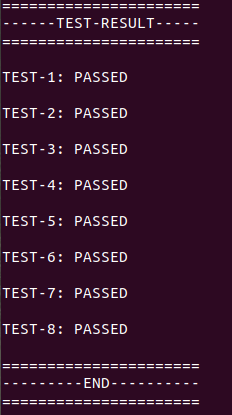

# Vexriscv SoC with UART & RAM
This example integrates an AXI based RAM onboarded to a Vexriscv SoC.

### Instructions:
Copy your demo folder from litex installation directory ``litex/litex/soc/software/demo`` and paste it inside your project directory. Use the main.c file provided in this example in the demo application and replace it with the main.c file located inside your newly copied demo folder in project directory.

## 1. Simulation
We can simulate this IP using litex_sim tool in litex.

Run the following command to generate your SoC:
```
litex_sim --integrated-main-ram-size=0x10000 --cpu-type vexriscv --sim-debug --no-compile-gateware --axiram
```
Run the following command to generate .bin file from .py file:
```
python3 ./demo/demo.py --build-path=build/sim
```
Before running the simulation, you have to create the binary of your application code residing in demo. The python script below converts the application code to demo.bin, which is later loaded on to the RAM.

Run the following command to execute your application:
```
litex_sim --integrated-main-ram-size=0x10000 --cpu-type vexriscv --ram-init=demo.bin --sim-debug --axiram
```
### Output:



## Application
This test does multiple reads and writes onto the axi based ram, this is done through detailed tests.