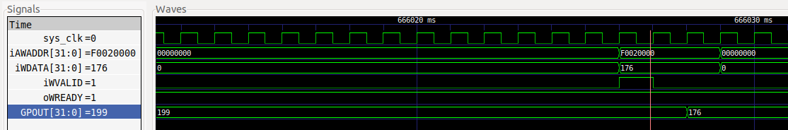
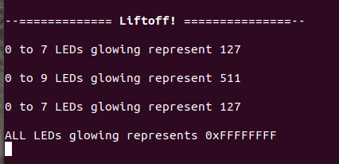

# Vexriscv SoC with UART and AXI-GPIO
THis is an example based on a 32 bit GPIO with Vexriscv SoC.

### Instructions:
Copy your demo folder from litex installation directory ``litex/litex/soc/software/demo`` and paste it inside your project directory. Use the main.c file provided in this example in the demo application and replace it with the main.c file located inside your newly copied demo folder in project directory.

## 1. Simulation

We can simulate the integration application code in main.c using litex_sim tool in litex.

Run the following command to generate your SoC:
```
litex_sim --integrated-main-ram-size=0x10000 --cpu-type=vexriscv --axigpio --no-compile-gateware --sim-debug
```
Before running the simulation, you have to create the binary of your application code residing in demo. The python script below converts the application code to demo.bin, which is later loaded on to the ram.

Run the following command to generate .bin file from .py file:
```
python3 ./demo/demo.py --build-path=build/sim
```
Run the following command to execute your applicationcode onto the processor:
```
litex_sim --integrated-main-ram-size=0x10000 --cpu-type vexriscv --axigpio --ram-init=demo.bin --sim-debug
```
### Output:





## Application
This test performs the write operation on specific addresses and the data is shown onto the console. This can be verified using the GTKwave.