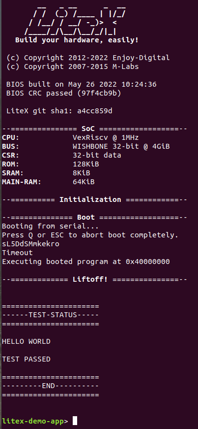
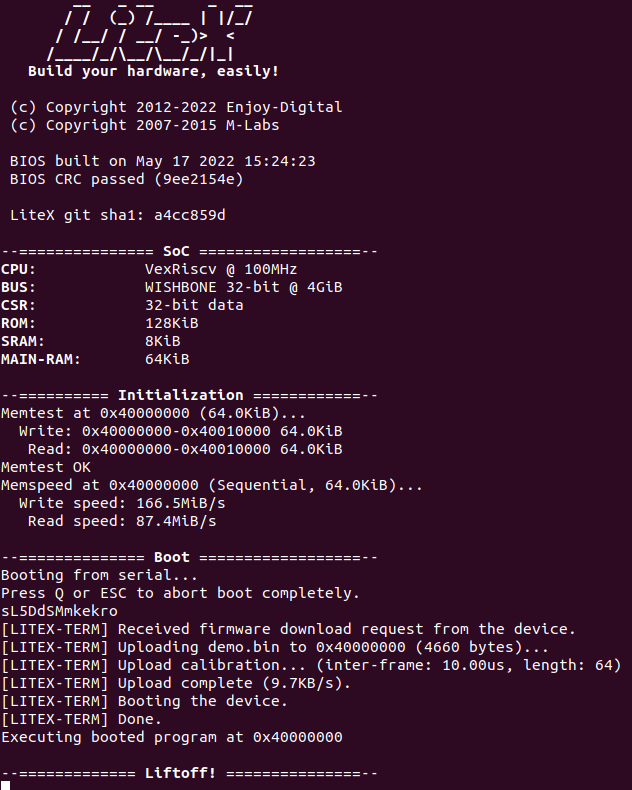

# Vexriscv SoC with UART & Hello World:
Hello World application application for Vexriscv based SoC.

### Instructions:
Copy your demo folder from litex installation directory ``litex/litex/soc/software/demo`` and paste it inside your project directory. Use the main.c file provided in this example in the demo application and replace it with the main.c file located inside your newly copied demo folder in project directory.

## 1. Simulation:
We can simulate the hello world example using litex_sim tool in litex.

Run the following command to generate your SoC:
```
litex_sim --integrated-main-ram-size=0x10000 --cpu-type=vexriscv --no-compile-gateware --sim-debug
```
Before running the simulation, you have to create the binary of your application code residing in demo. The python script below converts the application code to demo.bin, which is later loaded on to the RAM.

Run the following command to generate .bin file from .py file:
```
python3 ./demo/demo.py --build-path=build/sim
```
Run the following command to execute your applicationcode onto the processor:
```
litex_sim --integrated-main-ram-size=0x10000 --cpu-type vexriscv --ram-init=demo.bin --sim-debug
```


## Output:


## 2. Hardware:
Connect your Digilent Basys 3 board with your machine. We will be using the same design which we used in simulation to verify on the board. The following board file written in python creates the same SoC and later build and load it onto the Basys3 board.

Note: Before using this GPIO design on hardware, we need to replace the board files with the necessary changes provided in the ``board files`` directory. 


Run the following command to generate your SoC:
```
./../../litex_installation/litex-boards/litex_boards/targets/digilent_basys3.py --integrated-main-ram-size=0x10000 --cpu-type=vexriscv --build --load --uart-name=serial
```
Run the following command to generate .bin file from .py file:
```
python3 ./demo/demo.py --build-path=build/digilent_basys3
```
The litex_term tool load the board with the application binary through the COM port.
```
litex_term /dev/ttyUSB1 --kernel=demo.bin
```
## Output:


## Application
In this application code we print a Hello world to the Uart console(Litex Console).